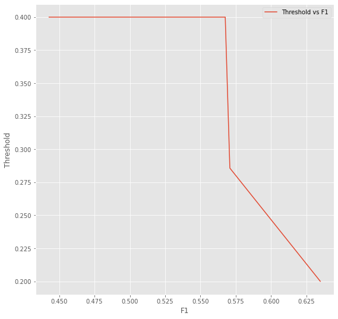
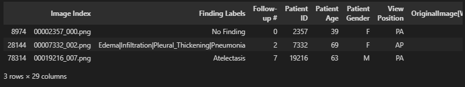

# FDA  Submission


**Your Name:** Larry Tientcheu

## Algorithm Description 

### 1. General Information

**Intended Use Statement:** 

* Assist the radiologist in the early diagnosis of Pneumonia from chest X-ray images of a patient to prevent adverse consequences (including death).

**Indications for Use:**

* Looking at the data in our EDA, we see that the algorithm was trained on patients who spanned from ages 0 to 90.
* Algorithm should be used for screening chest X-rays studies on patients from ages 0 to 90.

**Device Limitations:**

* The first biggest limitation is that there is no history of the associated patient considered in our evaluation model. 
* Since the model exercises a lot of convolutional layers, it needs very high computational power otherwise it’ll eat up a lot of time in computations.

**Clinical Impact of Performance:**

* All medical tests can result in false positive and false negative errors. Since medical tests can’t be absolutely true, false positives and false negatives are two problems we have to deal with. A false positive can lead to unnecessary treatment and a false negative can lead to a false diagnostic, which is very serious since a disease has been ignored. However, we can minimize the errors by collecting more information, considering other variables, adjusting the sensitivity (true positive rate) and specificity (true negative rate) of the test, or conducting the test multiple times. Even so, it is still hard since reducing one type of error means increasing the other type of error.
* For the clinical relevance, we have chosen sensitivity. Since our algorithm is used for screening studies, it is most confident when the test is negative, does eliminating most of the negative cases, enabling the radiologist to focus more on positive cases.
* **Recall Value: 0.571429**
* **Precision is: 0.307692**
* **Recall is: 0.5**
* **Threshold is: 0.442853**
* **F1 Score is:0.400000**

### 2. Algorithm Design and Function


**DICOM Checking Steps:**

* Validation set consist of Chest X-ray images from patients ages 0 to 90.

* Patient ID: Unique identifier of the sample. It is the link between the x-ray images and the annotations for each of the samples.

* Radiographic image: Image with fixed dimensions of 1024 x 1024.

* Sex of the patient: Categorical variable.

* Patient’s age: Numerical variable.

* View: Provides information on how the x-ray was taken. In PA view the x-ray passes from posterior of body to anterior and vice versa in the case of the AP view. Preferably the PA view is used, but for very sick people who cannot maintain their upright position the AP view is used

* Before sending the image through the algorithm, the image position, image type and body part were checked. Images that are not from the chest, not taken from either PA or AP positions and Modality not DX were excluded.

**Preprocessing Steps:**

* All images were normalized and the training set was augmented using horizontal flip and 10 degree range rotation.
* Training set ad Validation set both have appropriate proportions of posititve and negative cases. with a 80 to 20 split
* Target: It reduces the previous categorization in Binary x-ray cathegory where 0 means that the image is not a case of pneumonia and 1 if it is a case of pneumonia.

**CNN Architecture:**

```

Model: "vgg16"

_________________________________________________________________

Layer (type)                 Output Shape              Param #   

=================================================================

input_3 (InputLayer)         (None, 224, 224, 3)       0         

_________________________________________________________________

block1_conv1 (Conv2D)        (None, 224, 224, 64)      1792      

_________________________________________________________________

block1_conv2 (Conv2D)        (None, 224, 224, 64)      36928     

_________________________________________________________________

block1_pool (MaxPooling2D)   (None, 112, 112, 64)      0         

_________________________________________________________________

block2_conv1 (Conv2D)        (None, 112, 112, 128)     73856     

_________________________________________________________________

block2_conv2 (Conv2D)        (None, 112, 112, 128)     147584    

_________________________________________________________________

block2_pool (MaxPooling2D)   (None, 56, 56, 128)       0         

_________________________________________________________________

block3_conv1 (Conv2D)        (None, 56, 56, 256)       295168    

_________________________________________________________________

block3_conv2 (Conv2D)        (None, 56, 56, 256)       590080    

_________________________________________________________________

block3_conv3 (Conv2D)        (None, 56, 56, 256)       590080    

_________________________________________________________________

block3_pool (MaxPooling2D)   (None, 28, 28, 256)       0         

_________________________________________________________________

block4_conv1 (Conv2D)        (None, 28, 28, 512)       1180160   

_________________________________________________________________

block4_conv2 (Conv2D)        (None, 28, 28, 512)       2359808   

_________________________________________________________________

block4_conv3 (Conv2D)        (None, 28, 28, 512)       2359808   

_________________________________________________________________

block4_pool (MaxPooling2D)   (None, 14, 14, 512)       0         

_________________________________________________________________

block5_conv1 (Conv2D)        (None, 14, 14, 512)       2359808   

_________________________________________________________________

block5_conv2 (Conv2D)        (None, 14, 14, 512)       2359808   

_________________________________________________________________

block5_conv3 (Conv2D)        (None, 14, 14, 512)       2359808   

_________________________________________________________________

block5_pool (MaxPooling2D)   (None, 7, 7, 512)         0         

_________________________________________________________________

flatten (Flatten)            (None, 25088)             0         

_________________________________________________________________

fc1 (Dense)                  (None, 4096)              102764544 

_________________________________________________________________

fc2 (Dense)                  (None, 4096)              16781312  

_________________________________________________________________

predictions (Dense)          (None, 1000)              4097000   

=================================================================

Total params: 138,357,544

Trainable params: 138,357,544

Non-trainable params: 0

_________________________________________________________________

Model: "sequential_3"

_________________________________________________________________

Layer (type)                 Output Shape              Param #   

=================================================================

model_3 (Model)              (None, 7, 7, 512)         14714688  

_________________________________________________________________

flatten_3 (Flatten)          (None, 25088)             0         

_________________________________________________________________

dropout_7 (Dropout)          (None, 25088)             0         

_________________________________________________________________

dense_9 (Dense)              (None, 512)               12845568  

_________________________________________________________________

dropout_8 (Dropout)          (None, 512)               0         

_________________________________________________________________

dense_10 (Dense)             (None, 256)               131328    

_________________________________________________________________

dropout_9 (Dropout)          (None, 256)               0         

_________________________________________________________________

dense_11 (Dense)             (None, 64)                16448     

_________________________________________________________________

dense_12 (Dense)             (None, 1)                 65        

=================================================================

Total params: 27,708,097

Trainable params: 15,353,217

Non-trainable params: 12,354,880

_________________________________________________________________

```

### 3. Algorithm Training

**Parameters:**

* Types of augmentation used during training: `ImageDataGenerator(rescale=1. / 255.0,horizontal_flip = True,vertical_flip = False,height_shift_range= 0.1, width_shift_range=0.1,rotation_range=10,shear_range = 0.1,zoom_range=0.1)`

* Batch size : `Training set = 32`, `Validation set = 32`

* Optimizer learning rate = Adam(lr=0.001)

* Layers of pre-existing architecture that were frozen: 17

* Layers of pre-existing architecture that were fine-tuned: 0

* Layers added to pre-existing architecture: 4


##### Training Loss Curve


##### Precison Recall Curve


* A high precision test gives you more confidence that a positive test result is actually positive since a high precision test has low false positive. This metric, however, does not take false negatives into account. So a high precision test could still miss a lot of positive cases. Because of this, high-precision tests don’t necessarily make for great stand-alone diagnostics but are beneficial when you want to confirm a suspected diagnosis.


* When a high recall test returns a negative result, you can be confident that the result is truly negative since a high recall test has low false negatives. Recall does not take false positives into account though, so you may have high recall but are still labeling a lot of negative cases as positive. Because of this, high recall tests are good for things like screening studies, where you want to make sure someone doesn’t have a disease or worklist prioritization where you want to make sure that people without the disease are being de-prioritized.


* Optimizing one of these metrics usually comes at the expense of sacrificing the other. 


#### F1 vs Threshold graph




**Final Threshold and Explanation:**


* We have chosen a threshold according to our F1 score. The threshold is determined by taking the highest F1 score obtained on sensitivity(recall). Since our algorithm is used for screening studies, it is most confident when the test is negative, thus, eliminating most of the negative cases, enabling the radiologist to focus more on positive cases. `F1 = 0.352941` ,`Threshold = 0.559925`


### 4. Databases


**Description of Training Dataset:** 


* The training dataset consists of patients varying from age 0 to 90, both Male and Female. It contains a combination of images with Pneumonia and some of it comorbities and images with No Findings. The training set has been slpit 50% Pneumonia and the other 50% No Fidings.


**Description of Validation Dataset:** 


* The validation dataset consists of patients varying from age 0 to 90, both Male and Female. It contains a combination of images with Pneumonia and some of it comorbities and images with No Findings. The validation set has been made imbalanced with more No Findings than Pneumonia in order to relfect the real life scenarios.



### 5. Ground Truth


* Ground truth of the NIH dataset ground truth is derived from the labels labels in the NIH dataset. This could be a good thing because we believe a radiologist labeled these images. However, Since the NLP-derived labels from the NIH are sub-optimal, This could impact the algorithm’s clinical performance.


### 6. FDA Validation Plan


**Patient Population Description for FDA Validation Dataset:**


* Patients from all ethnicities from the ages of 0 to 90.

* Prior ilnesses of patients should be accounted for.


**Ground Truth Acquisition Methodology:**


*  At least silver standard or biopsy data is required for the ground truth.


**Algorithm Performance Standard:**


* According to this [resarch](https://stanfordmlgroup.github.io/projects/chexnet/) with Chexnet.


* With our algorithm, we should obtain an F1 score of: `0.400000` which is reasonable and very good.


